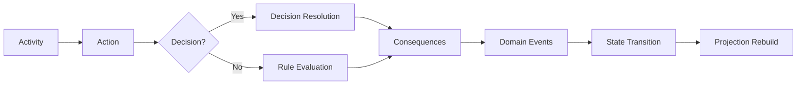

# Platform Foundation

**Document ID:** PS-DOM-001  
**Version:** 1.0  
**Status:** Approved

## Purpose

Define the highest-level hierarchy and business concepts of ProjectSim 2.0.

## Core Hierarchy

```text
Learning Program
└── Business Case
    └── Content Package Version
        └── Simulation Run
            ├── Chapter Progress
            │   └── Day Progress
            │       └── Activity Progress
            ├── Project State
            ├── Decisions
            ├── Consequences
            ├── Stakeholder Relationships
            └── Learning Evidence
```

## Core Concepts

### Learning Program
A structured learning experience containing one or more Business Cases.

### Business Case
A realistic project scenario defined as versioned content.

### Simulation Run
One learner's unique execution of one published Content Package version.

### Chapter
A major phase of project progression.

### Day
A playable session inside a Chapter.

### Activity
A required, optional, or conditional unit of work.

### Simulation Action
A typed learner or system intent submitted for validation.

### Decision
A specialized action that resolves a business situation.

### Consequence
A traceable effect caused by an action, decision, or event.

### Projection
A read-only model derived for a particular interface.

## Fundamental Processing Chain



## Revision History

| Version | Status | Description |
|---|---|---|
| 1.0 | Approved | Initial platform foundation |
