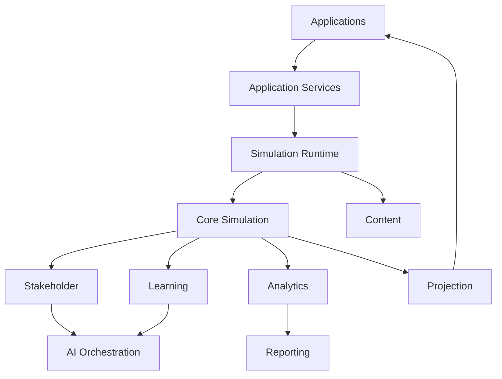

# Bounded Contexts and Engine Ownership

**Document ID:** PS-DOM-002  
**Version:** 1.0  
**Status:** Approved

## Context Catalog

| Context | Primary Responsibility |
|---|---|
| Simulation Runtime | Execution, sequencing, idempotency, replay |
| Core Simulation | Project state, progress, consequences, completion |
| Content | Published simulation definitions |
| Stakeholder | Relationship state and interaction history |
| Learning | Mastery, evidence, recommendations |
| Projection | Read-only interface models |
| Analytics | Trends, aggregates, forecasts |
| AI Orchestration | Grounded, validated AI assistance |
| Identity and Access | Authentication, roles, permissions, tenancy |
| Reporting | Audience-specific derived reports |

## Context Map

## Ownership Rule

No context may directly mutate another context's authoritative state.

## Shared Kernel

The Shared Kernel may contain:

- Branded identifiers
- Event envelope
- Result and error types
- Timestamps
- Correlation and causation IDs

It must not contain business rules, UI models, or AI prompts.

## Revision History

| Version | Status | Description |
|---|---|---|
| 1.0 | Approved | Initial bounded-context map |
