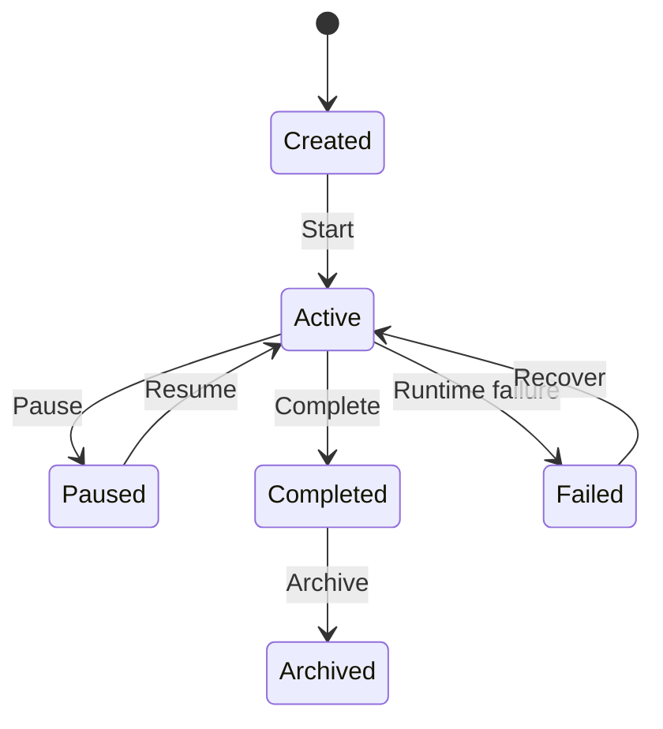

# Simulation Aggregate

**Document ID:** PS-DOM-003  
**Version:** 1.0  
**Status:** Approved

## Aggregate Root

`SimulationRun`

## Purpose

Represent one learner's authoritative execution of one published Content Package version.

## Aggregate Contents

- `SimulationState`
- `ActionRecord`
- `ScheduledEvent`
- `SimulationCheckpoint`
- `ProjectState`
- `ProjectMetrics`
- `ChapterProgress`
- `DayProgress`
- `ActivityProgress`
- `Decision`
- `DecisionOutcome`
- `Consequence`

## Logical Ownership

### Runtime-Owned
- Action sequencing
- Idempotency
- Checkpoints
- Replay
- Scheduled-event release
- Runtime lifecycle

### Core-Simulation-Owned
- Project state
- Metrics
- Progress
- Decisions
- Outcomes
- Consequences
- Completion

## Lifecycle



## Invariants

1. One run references one immutable Content Package version.
2. Only active runs accept normal learner actions.
3. Action sequence numbers are strictly increasing.
4. Duplicate actions do not duplicate effects.
5. Completion is derived from explicit requirements.
6. Replay reproduces the same state for the same input history.
7. Checkpoints optimize replay but never replace history.
8. Decision outcomes are immutable once resolved.

## Conceptual Contract

```ts
interface SimulationRun {
  id: SimulationRunId;
  learnerId: LearnerId;
  contentPackageVersionId: ContentPackageVersionId;
  status: SimulationRunStatus;
  aggregateVersion: number;
  lastProcessedSequence: number;
  state: SimulationState;
}
```

## Revision History

| Version | Status | Description |
|---|---|---|
| 1.0 | Approved | Initial Simulation Aggregate |
