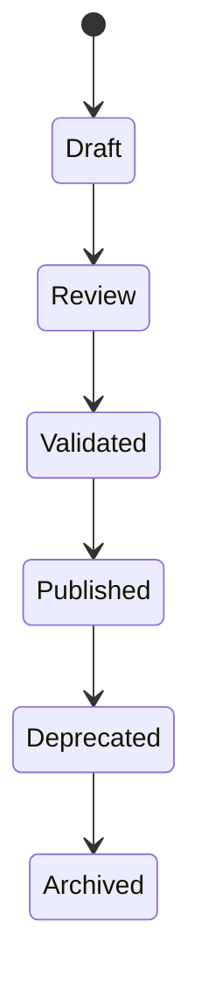

# Content Aggregate

**Document ID:** PS-DOM-004  
**Version:** 1.0  
**Status:** Approved

## Aggregate Root

`ContentPackage`

## Purpose

Define the immutable authored experience that a Simulation Run executes.

## Core Entities

- Learning Program
- Business Case
- Content Package
- Content Package Version
- Chapter Definition
- Day Definition
- Activity Definition
- Decision Definition
- Decision Option Definition
- Consequence Definition
- Event Definition
- Stakeholder Definition
- Document Definition
- Email Definition
- Meeting Definition
- Reflection Definition
- Assessment Definition
- Completion Rule Definition
- Content Asset

## Core Distinction

```text
Content = What can happen
Simulation = What did happen
```

## Lifecycle



## Invariants

1. Published versions are immutable.
2. Simulation Runs reference exact versions.
3. Content never stores learner progress.
4. Completion logic is declarative.
5. All references must resolve before publication.
6. Content packages cannot contain arbitrary executable application code.
7. New Business Cases should require content, not core-code changes.

## Revision History

| Version | Status | Description |
|---|---|---|
| 1.0 | Approved | Initial Content Aggregate |
