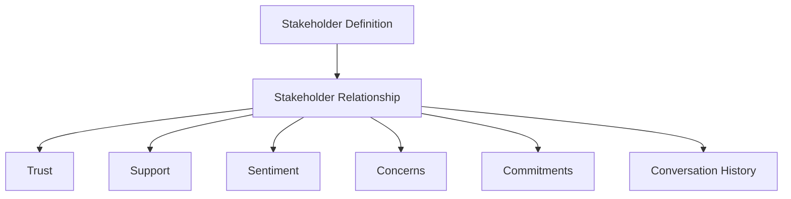

# Stakeholder Aggregate

**Document ID:** PS-DOM-005  
**Version:** 1.0  
**Status:** Approved (blueprint)

> **Runtime ownership note (PS-ROADMAP-018 / PS-DOM-019):** the implemented v1
> authoritative Stakeholder runtime model (identity, learner-safe profile,
> one conversation per Stakeholder, learner→Stakeholder messages) lives on
> **SimulationRun / SimulationState**, not as a standalone aggregate with its
> own repository/outbox. Trust/sentiment/commitment relationship scoring from
> this blueprint remains deferred. See
> [19_Authoritative_Stakeholder_Model.md](./19_Authoritative_Stakeholder_Model.md).

## Aggregate Root

`StakeholderRelationship`

## Purpose

Represent the evolving runtime relationship between a learner and one stakeholder in one Simulation Run.

## Core Entities and Value Objects

- Stakeholder State
- Trust
- Support
- Influence
- Sentiment
- Concern
- Commitment
- Conversation Thread
- Conversation Message
- Interaction Record
- Behavioral Posture
- Pending Request
- Escalation
- Relationship Timeline

## Relationship Model

## Invariants

1. Conversation history is append-only.
2. Relationship changes require traceable causes.
3. Sentiment may change faster than trust.
4. Broken commitments affect relationship state.
5. AI may express stakeholder state but may not redefine it.
6. Stakeholder state belongs to one Simulation Run.
7. Completed activities do not delete conversations.

## Revision History

| Version | Status | Description |
|---|---|---|
| 1.0 | Approved | Initial Stakeholder Aggregate |
