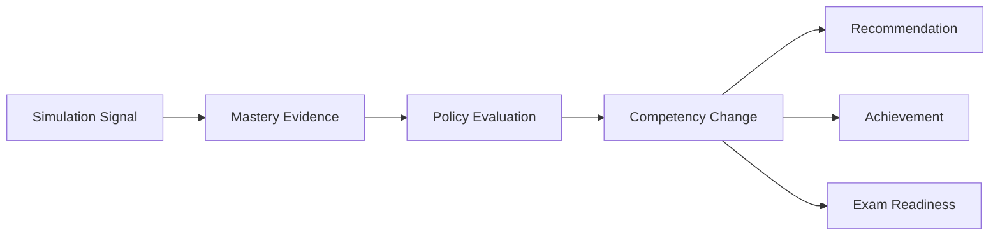

# Learning Aggregate

**Document ID:** PS-DOM-006  
**Version:** 1.0  
**Status:** Approved

## Aggregate Root

`LearnerMasteryProfile`

## Purpose

Represent what a learner has demonstrated across one or more Simulation Runs.

## Core Entities

- Competency
- Competency State
- Learning Objective State
- Mastery Evidence
- Reflection
- Assessment Attempt
- Weakness Profile
- Strength Profile
- Coaching History
- Recommendation Queue
- Achievement
- Learning Timeline
- Exam Readiness Profile
- Confidence Model

## Learning Pipeline

## Invariants

1. Mastery changes require traceable evidence.
2. Project success does not equal learning success.
3. Assessment history is append-only.
4. Reflections are permanent learning artifacts.
5. Confidence must be reported with mastery.
6. AI evaluation is advisory until validated.
7. Learning spans multiple Simulation Runs.

## Revision History

| Version | Status | Description |
|---|---|---|
| 1.0 | Approved | Initial Learning Aggregate |
