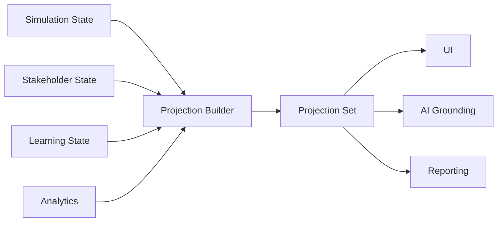

# Projection Aggregate

**Document ID:** PS-DOM-007  
**Version:** 1.0  
**Status:** Approved

## Aggregate Root

`ProjectionSet`

## Purpose

Transform authoritative domain state into read-only interface models.

## Projection Types

- Mission Control
- Program Dashboard
- Daily Briefing
- Inbox
- Meeting Center
- Stakeholder View
- Learning View
- Reports
- Timeline
- Notifications
- Maya Workspace
- Executive Summary
- Completion Readiness

## Projection Pipeline

## Invariants

1. Projections are read-only.
2. Projections are disposable and rebuildable.
3. Projections do not accept business commands.
4. UI components do not reconstruct domain truth.
5. Every projection identifies source versions.
6. Projection failures do not corrupt authoritative state.

## Core Principle

Mission Control, Dashboard, Inbox, and Reports are views, not authoritative domains.

## Implementation contracts (PS-ROADMAP-009)

Shared envelope, taxonomy, and hybrid topology (ADR-006) for Milestone 2 are
specified in `docs/architecture/08-workplace-projection-contracts/`. Executable
code today still ships only `projectionType: "simulation"`.

## Revision History

| Version | Status | Description |
|---|---|---|
| 1.0 | Approved | Initial Projection Aggregate |
| 1.1 | Approved | Link PS-ROADMAP-009 workplace projection contracts |
