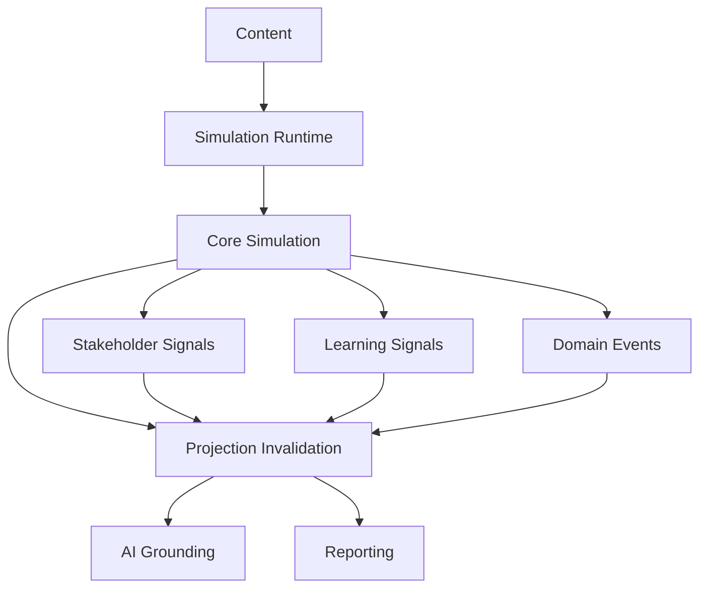

# Cross-Aggregate Relationships

**Document ID:** PS-DOM-012  
**Version:** 1.0  
**Status:** Approved

## Communication Mechanisms

- Commands
- Domain Events
- Signals
- Queries
- Projections
- Stable identifiers

Direct cross-aggregate mutation is prohibited.

## Collaboration Map



## Long-Running Workflows

Cross-context processes use sagas.

Example closeout:

```text
Simulation Completed
→ Learning Finalized
→ Achievements Evaluated
→ Analytics Snapshot Created
→ Final Report Generated
→ Run Archived
```

## Anti-Corruption Layers

External systems such as Jira, Azure DevOps, Microsoft Project, Primavera, Asana, Monday.com, and Smartsheet must integrate through adapters that protect the ProjectSim domain model.

## Invariants

1. Aggregates never directly modify one another.
2. Long-running workflows are independently recoverable.
3. External schemas never become internal domain contracts.
4. Every dependency is documented.
5. Projection remains read-only.
6. AI remains non-authoritative.

## Revision History

| Version | Status | Description |
|---|---|---|
| 1.0 | Approved | Initial cross-aggregate model |
