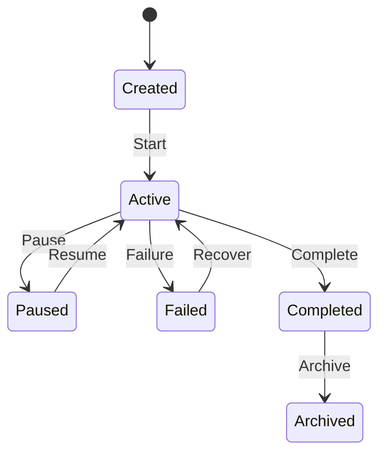
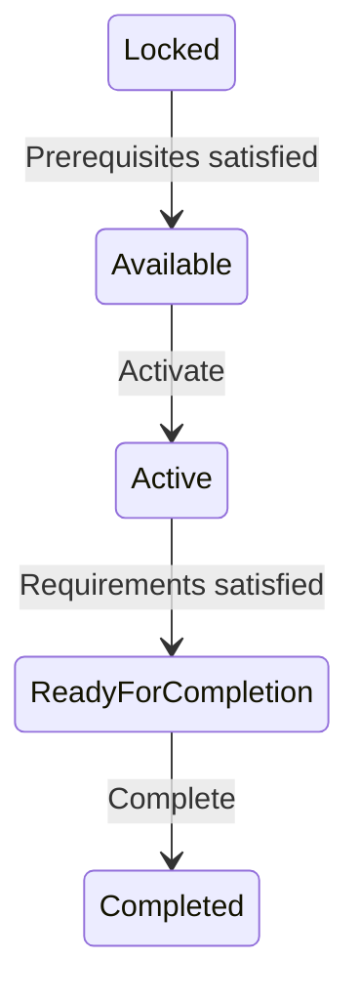
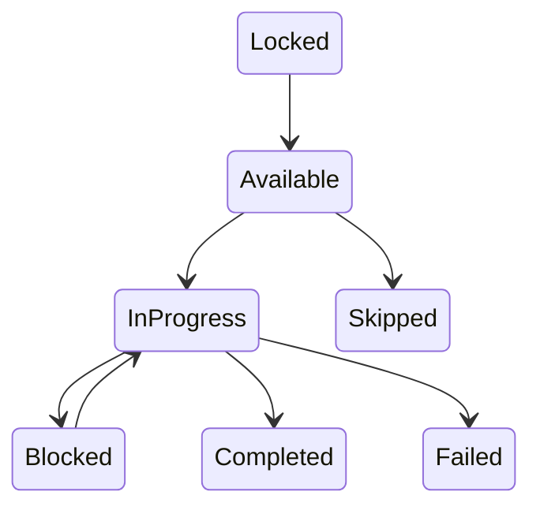
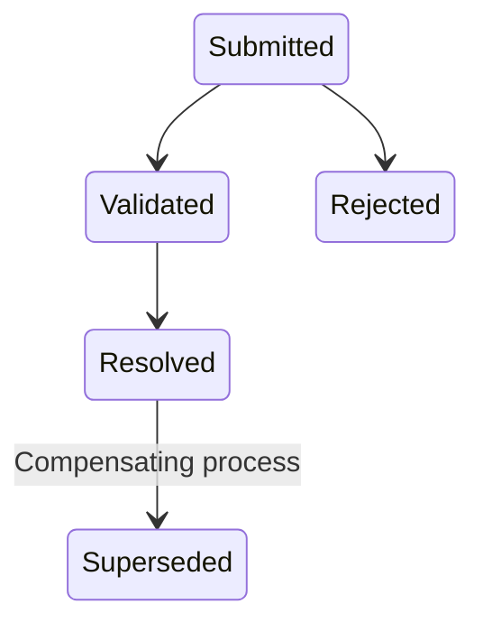
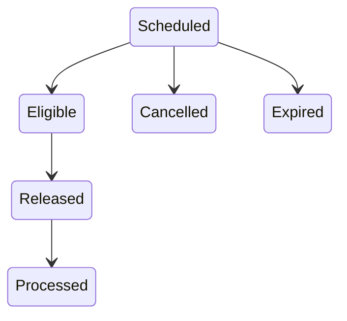
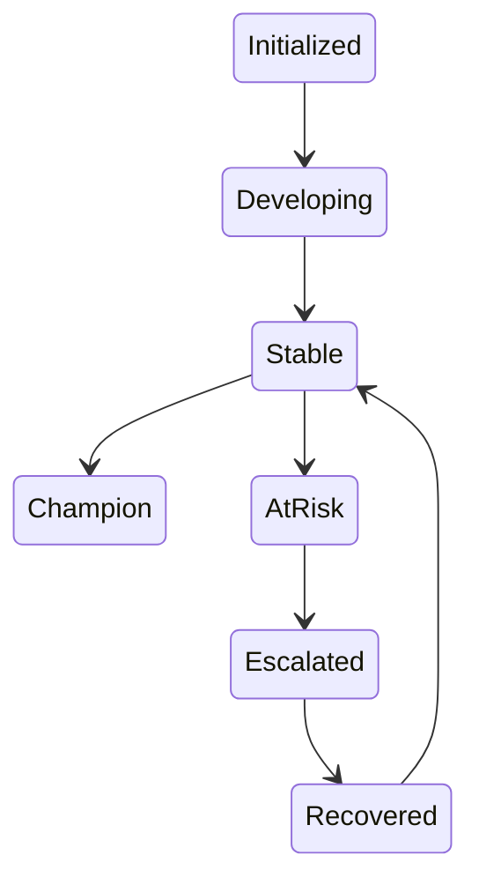
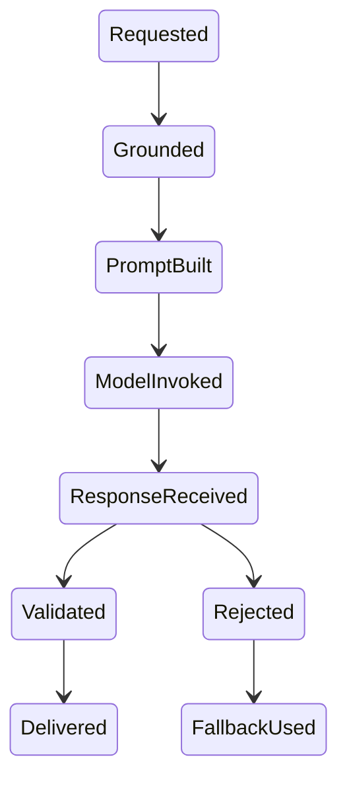

# Canonical State Machines

**Document ID:** PS-DOM-014  
**Version:** 1.0  
**Status:** Approved

## Simulation Run

## Chapter and Day Progress

## Activity Progress

## Decision

## Scheduled Event

## Stakeholder Relationship

## AI Interaction

## Rule

No implicit state transitions are permitted. Invalid transitions return typed domain errors.

## Revision History

| Version | Status | Description |
|---|---|---|
| 1.0 | Approved | Initial canonical state machines |
