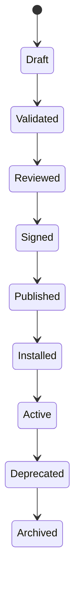

# Platform Extension Framework

**Document ID:** PS-DOM-016  
**Version:** 1.0  
**Status:** Approved

## Purpose

Enable ProjectSim capabilities to evolve without modifying the stable core.

## Extension Types

- Business Case SDK
- Learning SDK
- Assessment SDK
- Reporting SDK
- AI Persona SDK
- Integration SDK
- Analytics SDK
- Theme SDK
- Enterprise Configuration SDK

## Package Manifest

Every extension declares:

```yaml
id: example.package
version: 1.0.0
author: Example Author
license: Proprietary
minimumRuntime: 2.0.0
sdkVersion: 1.0.0
dependencies: []
permissions: []
checksum: sha256:...
signature: ...
```

## Package Lifecycle



## Validation

Extensions must pass:

- Schema validation
- Reference validation
- Compatibility validation
- Security validation
- Accessibility validation where applicable
- Performance validation
- Content validation
- Signature validation

## Security Boundaries

Extensions may not:

- Access internal persistence directly
- Bypass permissions
- Modify aggregate state outside commands
- Publish unregistered authoritative events
- Override platform invariants
- Execute arbitrary code in trusted processes without sandboxing

## Marketplace Direction

A future marketplace may distribute:

- Business Cases
- AI Personas
- Assessments
- Reports
- Themes
- Integrations
- Industry Packs

## Invariants

1. Core remains stable while extensions evolve.
2. Every extension is independently versioned.
3. Compatibility is explicit.
4. Enterprise customization must not require code forks.
5. Extensions use public contracts only.

## Revision History

| Version | Status | Description |
|---|---|---|
| 1.0 | Approved | Initial extension framework |
