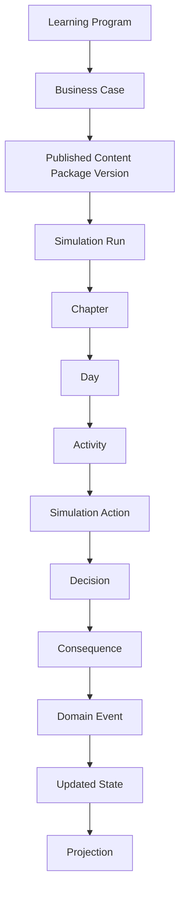

# ProjectSim 2.0 Domain Model

**Document ID:** PS-DOM-000  
**Version:** 1.0  
**Status:** Approved  
**Owner:** Chief Software Architect

## Purpose

Define the canonical business model for ProjectSim 2.0.

The Domain Model establishes:

- Ubiquitous language
- Bounded contexts
- Aggregate ownership
- Entity lifecycles
- Domain events
- State machines
- Business invariants
- Extension boundaries

## Governing Rule

Technology must adapt to the domain. The domain must not be distorted to fit UI frameworks, database tables, or AI-provider behavior.

## Platform Hierarchy

## Core Rules

1. Every authoritative value has one owner.
2. Every state transition is explicit.
3. Every business change is traceable.
4. UI consumes projections.
5. AI remains non-authoritative.
6. Published content is immutable.
7. Learning mastery requires evidence.
8. Replay must remain deterministic.

## Related Documents

- [Platform Foundation](01_Platform_Foundation.md)
- [Bounded Contexts](02_Bounded_Contexts.md)
- [Business Invariants](15_Business_Invariants.md)
- [Authoritative Learner Message Lifecycle](17_Authoritative_Learner_Message_Lifecycle.md)

## Revision History

| Version | Status | Description |
|---|---|---|
| 1.0 | Approved | Initial domain model baseline |
