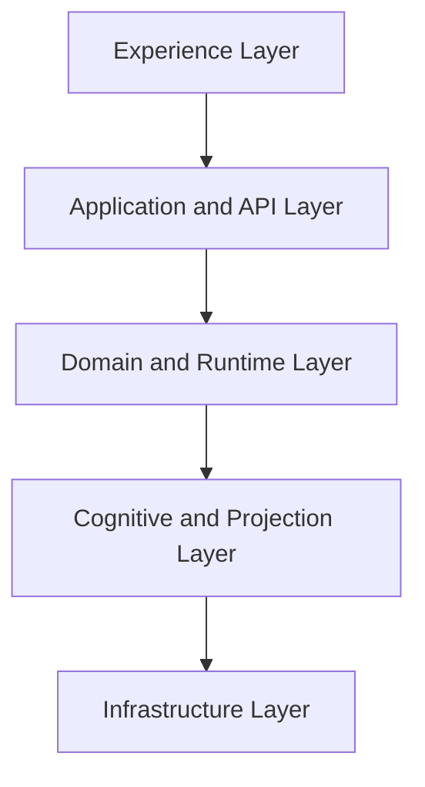

# System Architecture Overview

**Document ID:** PS-ARCH-000  
**Version:** 1.0  
**Status:** Approved  
**Owner:** Chief Software Architect

## Purpose

Define the technical architecture for ProjectSim 2.0.

## Architecture Classification

ProjectSim 2.0 is a modular, event-driven, content-driven simulation platform with a deterministic runtime, domain-centric core, CQRS-style projections, immutable history, and non-authoritative AI orchestration.

## Five-Layer Model

## Architecture Goals

1. Deterministic replay
2. One source of truth
3. Strong testability
4. Clear module ownership
5. Content extensibility
6. Safe AI integration
7. Horizontal scalability
8. High observability
9. Incremental delivery
10. Enterprise readiness

## Technology Baseline

| Area | Technology |
|---|---|
| Frontend | React + TypeScript |
| Build | Vite |
| Package Management | pnpm |
| Monorepo | Turborepo |
| Backend | Supabase |
| Database | PostgreSQL |
| Auth | Supabase Auth |
| Hosting | Vercel + Supabase |
| Documentation | Markdown + Mermaid |
| CI/CD | GitHub Actions |

## Architecture Rule

The UI never reads raw authoritative tables and never calculates completion, metrics, mastery, or stakeholder truth.

## Revision History

| Version | Status | Description |
|---|---|---|
| 1.0 | Approved | Initial system architecture overview |
