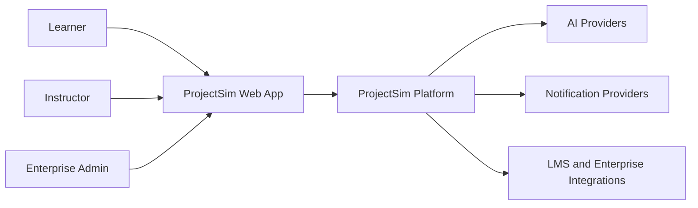
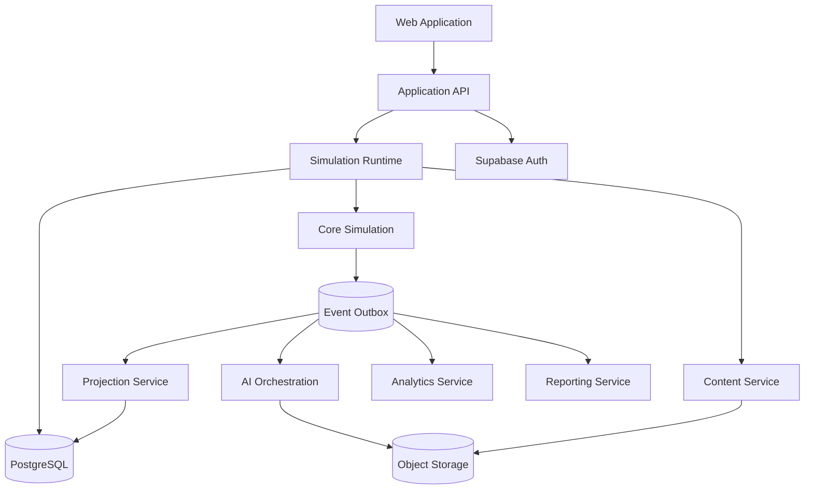

# C4 Context and Container Architecture

**Document ID:** PS-ARCH-002  
**Version:** 1.0  
**Status:** Approved

## System Context

## Container View

## Container Responsibilities

- **Web Application:** rendering, accessibility, navigation, local interaction state
- **Application API:** authentication context, authorization, validation, command/query dispatch
- **Simulation Runtime:** sequencing, idempotency, replay, checkpoints, scheduling
- **Core Simulation:** rules, consequences, project state, progress, completion
- **Projection Service:** read models for Mission Control, Inbox, Meetings, Learning, Reports
- **AI Orchestration:** grounding, routing, validation, fallback
- **Analytics:** derived metrics, trends, insights, forecasts

## Revision History

| Version | Status | Description |
|---|---|---|
| 1.0 | Approved | Initial C4 model |
