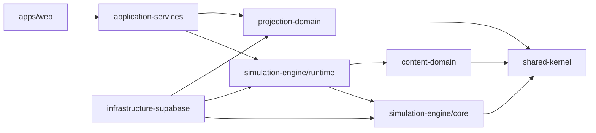

# Monorepo and Package Architecture

**Document ID:** PS-ARCH-003  
**Version:** 1.0  
**Status:** Approved

## Structure

```text
projectsim-2/
├── apps/
│   └── web/
├── packages/
│   ├── simulation-engine/
│   │   ├── runtime/
│   │   ├── core/
│   │   ├── contracts/
│   │   └── testing/
│   ├── content-domain/
│   ├── stakeholder-domain/
│   ├── learning-domain/
│   ├── projection-domain/
│   ├── analytics-domain/
│   ├── ai-orchestration/
│   ├── application-services/
│   ├── infrastructure-supabase/
│   └── shared-kernel/
├── supabase/
├── tests/
├── docs/
└── .github/
```

## Dependency Direction



## Rules

1. Domain packages do not import UI packages.
2. Core Simulation does not import AI SDKs.
3. Infrastructure implements domain repository interfaces.
4. Shared Kernel remains minimal.
5. Application services coordinate but do not own business rules.
6. Dependency boundaries are enforced by linting and tests.

## Revision History

| Version | Status | Description |
|---|---|---|
| 1.0 | Approved | Initial package architecture |
