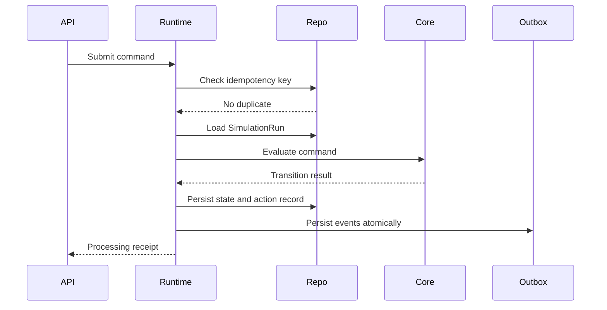

# Simulation Runtime Architecture

**Document ID:** PS-ARCH-004  
**Version:** 1.0  
**Status:** Approved

## Responsibilities

- Create and initialize runs
- Bind runs to immutable content versions
- Accept commands
- Enforce idempotency
- Sequence actions
- Persist action records
- Invoke Core Simulation
- Create checkpoints
- Schedule and release events
- Support deterministic replay
- Recover from partial failures

## Runtime Pipeline

## Runtime Components

- Command Gateway
- Idempotency Service
- Sequence Allocator
- Aggregate Loader
- Transition Coordinator
- Action Recorder
- Checkpoint Manager
- Replay Engine
- Scheduled Event Dispatcher
- Outbox Publisher

## Failure Rules

Domain rejection leaves state unchanged. Infrastructure failures are retried. AI failures never roll back authoritative simulation state.

## Revision History

| Version | Status | Description |
|---|---|---|
| 1.0 | Approved | Initial runtime architecture |
