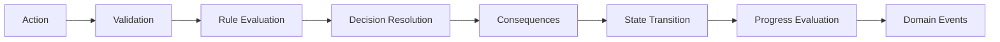

# Core Simulation Architecture

**Document ID:** PS-ARCH-005  
**Version:** 1.0  
**Status:** Approved

## Core Contract

```ts
interface CoreSimulationService {
  evaluate(
    state: SimulationState,
    action: SimulationAction,
    content: SimulationDefinition,
  ): SimulationTransitionResult;
}
```

## Internal Components

- Action Validator
- Rule Engine
- Decision Resolver
- Consequence Engine
- Progress Engine
- Risk and Issue Engine
- Metric Engine
- Completion Evaluator
- Domain Event Factory

## Internal Flow



## Purity Requirements

Core Simulation avoids network calls, direct database access, global clocks, and uncontrolled randomness. Time and seeded randomness are injected.

## Revision History

| Version | Status | Description |
|---|---|---|
| 1.0 | Approved | Initial core architecture |
