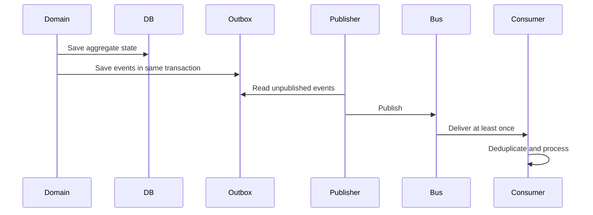

# Event Processing Architecture

**Document ID:** PS-ARCH-007  
**Version:** 1.0  
**Status:** Approved

## Preferred Pattern

Use a transactional outbox.

## Delivery Semantics

- At-least-once delivery
- Idempotent consumers
- No global ordering assumption
- Aggregate sequence is authoritative
- Dead-letter handling for repeated failures

## Consumers

- Projection builders
- Learning signal handlers
- Stakeholder signal handlers
- Analytics consumers
- Reporting workflows
- AI context invalidation
- Audit pipelines

## Versioning

Breaking changes require a new event version or event type. Historical events remain immutable.

## Revision History

| Version | Status | Description |
|---|---|---|
| 1.0 | Approved | Initial event processing architecture |
