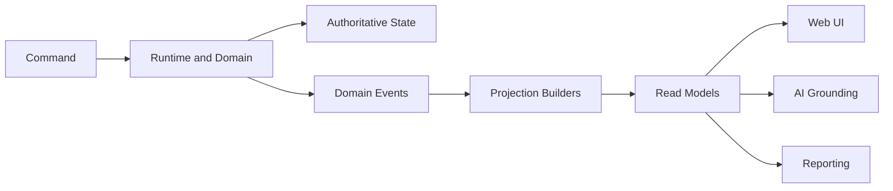

# Projection and CQRS Architecture

**Document ID:** PS-ARCH-008  
**Version:** 1.0  
**Status:** Approved

## Purpose

Separate authoritative writes from optimized reads.

## CQRS Model

## Projection Types

- Mission Control
- Dashboard
- Daily Briefing
- Inbox
- Meetings
- Stakeholders
- Learning
- Completion Readiness
- Timeline
- Executive Summary

## Rules

1. Projections are rebuildable.
2. Projections may be cached.
3. Projections identify source versions.
4. Projection failure does not roll back domain state.
5. UI queries projection contracts only.
6. Projection builders may combine multiple bounded contexts.

## Consistency

The UI may temporarily observe eventual consistency. Command receipts include the resulting state version so clients can refresh until the corresponding projection version is available.

## Implementation contracts (PS-ROADMAP-009)

Executable Milestone 1 shipped one canonical `projectionType: "simulation"`.
Milestone 2 workplace topology and shared envelope rules are specified in:

- `docs/architecture/08-workplace-projection-contracts/`
- `docs/adr/ADR-006-cqrs-style-projection-architecture.md`

Those contracts preserve one authoritative write model and do not by themselves
implement workplace product surfaces.

## Revision History

| Version | Status | Description |
|---|---|---|
| 1.0 | Approved | Initial CQRS and projection architecture |
| 1.1 | Approved | Link PS-ROADMAP-009 workplace projection contracts / ADR-006 |
