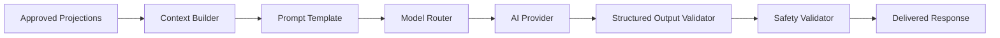

# AI Integration Architecture

**Document ID:** PS-ARCH-010  
**Version:** 1.0  
**Status:** Approved

## AI Boundary

## Rules

1. AI never reads unrestricted production tables.
2. AI output is untrusted until validated.
3. AI cannot directly write domain state.
4. AI changes become typed commands and pass domain validation.
5. Prompts, personas, models, and schemas are versioned.
6. AI failure uses deterministic fallbacks where practical.
7. Material outputs retain provenance.

## Capabilities

- Maya coaching
- Stakeholder dialogue
- Reflection evaluation
- Executive briefings
- Recommendations
- Narrative assistance
- Knowledge assistance

## Provider Abstraction

Model providers are selected by policy rather than embedded throughout application code.

## Revision History

| Version | Status | Description |
|---|---|---|
| 1.0 | Approved | Initial AI integration architecture |
