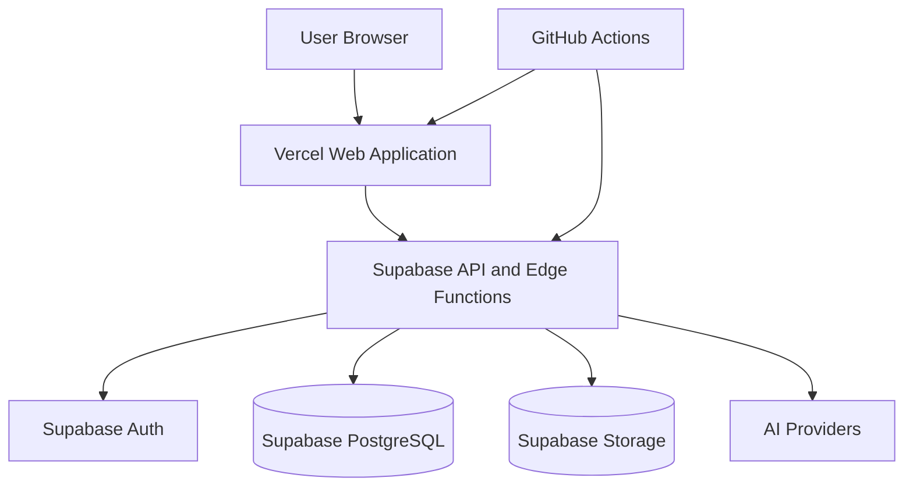

# Deployment Topology

**Document ID:** PS-ARCH-014  
**Version:** 1.0  
**Status:** Approved

## MVP Topology

## Environments

- Local
- Development
- Preview
- Staging
- Production

Each environment has isolated configuration, secrets, and databases.

## Rules

1. Production deploys originate from protected branches.
2. Database migrations run before dependent code.
3. Feature flags protect incomplete capabilities.
4. Rollback procedures are documented.
5. Preview environments use non-production data.
6. Infrastructure configuration is version-controlled.

## Future Evolution

At higher scale, event processing and AI orchestration may move to dedicated worker services without changing domain contracts.

## Revision History

| Version | Status | Description |
|---|---|---|
| 1.0 | Approved | Initial deployment topology |
