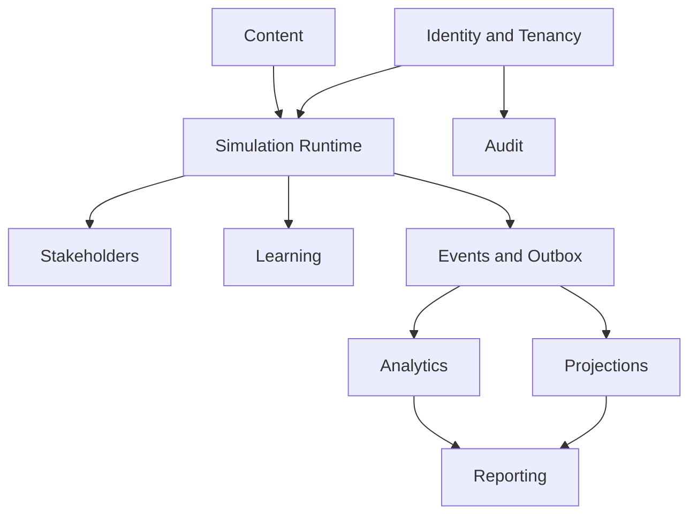

# Database Architecture Overview

**Document ID:** PS-DB-000  
**Version:** 1.0  
**Status:** Approved  
**Owner:** Data Architecture

## Purpose

Define the authoritative PostgreSQL and Supabase persistence model for ProjectSim 2.0.

## Database Strategy

ProjectSim 2.0 uses PostgreSQL as the authoritative system of record and Supabase as the managed platform for PostgreSQL, authentication, row-level security, object storage, Edge Functions, and selected realtime capabilities.

## Core Principles

1. Domain ownership is reflected in schema ownership.
2. Authoritative writes pass through application services.
3. UI clients do not directly mutate authoritative simulation tables.
4. History is append-only where traceability matters.
5. Published content is immutable.
6. Projections are rebuildable.
7. Multi-tenancy is enforced at the database layer.
8. Migrations are version-controlled.
9. Important state changes are auditable.
10. AI data remains separate from authoritative state.

## Logical Database Areas

## Supabase Rule

Supabase is infrastructure, not the domain model. Domain code must not depend directly on generated database types.

## Revision History

| Version | Status | Description |
|---|---|---|
| 1.0 | Approved | Initial database architecture overview |
