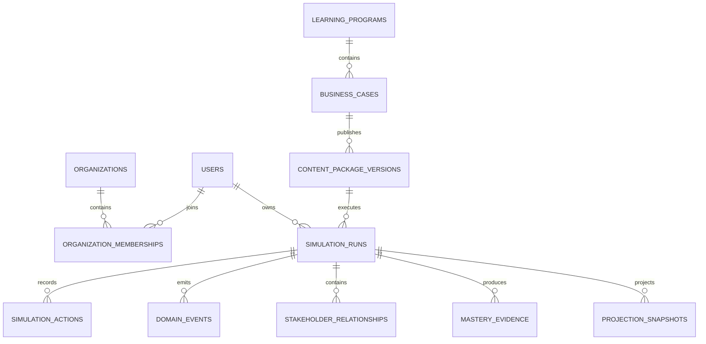

# Core Relational Model

**Document ID:** PS-DB-002  
**Version:** 1.0  
**Status:** Approved

## High-Level ERD

## Identifier Strategy

Use UUIDs for externally visible identifiers and stable IDs across API contracts, events, audit records, projections, and reports.

## Timestamp Strategy

Store timestamps in UTC using `timestamptz`. Distinguish `created_at`, `updated_at`, `occurred_at`, `recorded_at`, `effective_at`, and `scheduled_for`.

## JSONB Policy

Use JSONB for versioned content documents, event payloads, projection payloads, flexible metadata, and AI provenance. Do not use JSONB to avoid modeling stable relational entities.

## Revision History

| Version | Status | Description |
|---|---|---|
| 1.0 | Approved | Initial relational model |
