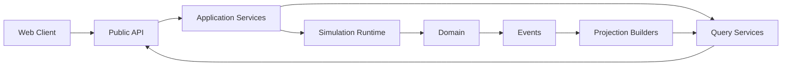

# API Architecture Overview

**Document ID:** PS-API-000  
**Version:** 1.0  
**Status:** Approved  
**Owner:** Platform Architecture

## Purpose

Define how clients, application services, bounded contexts, and external integrations communicate.

## API Styles

ProjectSim uses:

- REST for external resource and command APIs
- Internal TypeScript interfaces for in-process contracts
- Domain events for asynchronous integration
- Realtime subscriptions for selected read-model updates
- Webhooks for approved external notifications

## High-Level Flow



## API Boundary Rules

1. External clients never call domain packages directly.
2. Commands and queries use different contracts.
3. Raw database tables are not public APIs.
4. Authoritative writes use server-controlled endpoints.
5. API contracts remain independent from Supabase-generated types.
6. AI endpoints are non-authoritative.
7. Every mutating request is authenticated, authorized, validated, and auditable.

## Base Path

```text
/api/v1
```

## Revision History

| Version | Status | Description |
|---|---|---|
| 1.0 | Approved | Initial API architecture |
