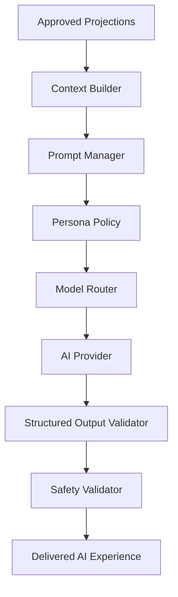

# AI Architecture Overview

**Document ID:** PS-AI-000  
**Version:** 1.0  
**Status:** Approved  
**Owner:** AI Platform Architecture

## Purpose

Define how ProjectSim 2.0 uses AI safely, consistently, and transparently.

## Architecture Position

AI is an assistive layer around the simulation platform. It does not own project state, learner mastery, stakeholder truth, completion, or scoring.

## AI Capability Map

## Primary AI Capabilities

- Maya coaching
- Stakeholder dialogue
- Reflection feedback
- Executive briefings
- Learning recommendations
- Scenario narration
- Knowledge assistance
- Assessment support
- Content-authoring assistance

## Core Rule

AI can explain, suggest, simulate, summarize, classify, and generate language. It cannot directly mutate authoritative domain state.

## Revision History

| Version | Status | Description |
|---|---|---|
| 1.0 | Approved | Initial AI architecture |
