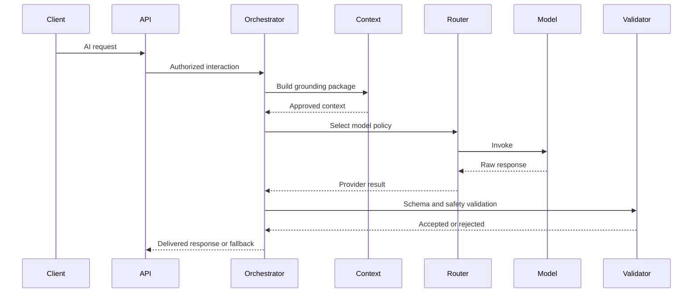

# AI Orchestration Platform

**Document ID:** PS-AI-002  
**Version:** 1.0  
**Status:** Approved

## Responsibilities

- Receive AI requests
- Resolve persona and policy
- Build grounding context
- Select prompt version
- Route to a model provider
- Validate structured output
- Run safety checks
- Apply fallback behavior
- Store provenance
- Emit observability signals

## Service Flow

## Internal Components

- AI Interaction Service
- Context Builder
- Prompt Registry
- Persona Registry
- Model Router
- Output Validator
- Safety Service
- Fallback Service
- Provenance Store
- Evaluation Service

## Revision History

| Version | Status | Description |
|---|---|---|
| 1.0 | Approved | Initial orchestration platform |
