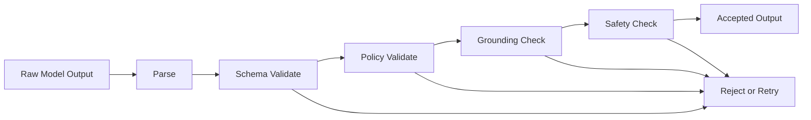

# Structured Output and Validation

**Document ID:** PS-AI-011  
**Version:** 1.0  
**Status:** Approved

## Purpose

Convert untrusted model output into safe application data.

## Validation Pipeline

## Validation Layers

- Syntax
- JSON schema
- Type constraints
- Required fields
- Allowed enums
- Length limits
- Grounding consistency
- Prohibited content
- Persona-policy compliance
- Domain-reference validity

## Rules

1. Model output is never trusted by default.
2. Structured output is required for machine-consumed responses.
3. Invalid responses are retried only within configured limits.
4. Repeated failure uses fallback.
5. Validation errors are observable.
6. Human-readable content is sanitized.
7. Model-proposed IDs must resolve.
8. AI outputs cannot create authoritative state directly.
9. Validator versions are recorded.
10. Accepted outputs retain raw-response references where policy permits.

## Revision History

| Version | Status | Description |
|---|---|---|
| 1.0 | Approved | Initial structured-output architecture |
