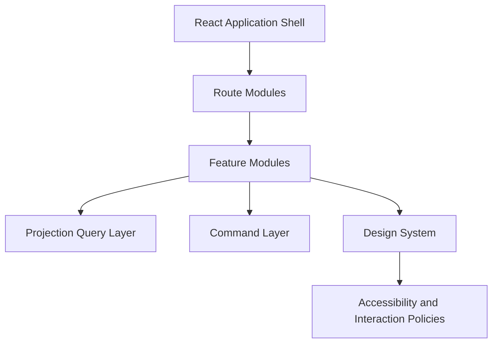

# UI Architecture Overview

**Document ID:** PS-UI-000  
**Version:** 1.0  
**Status:** Approved  
**Owner:** Experience Architecture

## Purpose

Define how ProjectSim 2.0 presents simulation, learning, stakeholder, and reporting capabilities through a consistent, projection-driven interface.

## UI Architecture Model

## Core Principles

1. UI renders projections.
2. UI never owns authoritative business state.
3. Commands express user intent.
4. Feature modules align with bounded contexts.
5. Components remain composable and testable.
6. Accessibility is built into the design system.
7. Completed work remains visible through history and archives.
8. Navigation must clearly distinguish operational, learning, and reporting spaces.
9. AI content is visibly identified.
10. Responsive layouts preserve task priority.

## Primary Experience Areas

- Program
- Mission Control
- Inbox
- Meetings
- Stakeholders
- Decisions
- Risks and Issues
- Learning
- Reports
- Maya
- Settings

## Revision History

| Version | Status | Description |
|---|---|---|
| 1.0 | Approved | Initial UI architecture |
