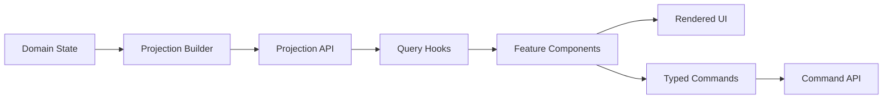

# Projection-Driven UI

**Document ID:** PS-UI-003  
**Version:** 1.0  
**Status:** Approved

## Principle

The UI must not calculate authoritative values from raw event arrays or duplicate domain logic.

## Data Flow



## Projection Examples

- Mission Control Projection
- Inbox Projection
- Meeting Center Projection
- Stakeholder Projection
- Decision Log Projection
- Completion Readiness Projection
- Learning Projection
- Report Projection

## Rules

1. Counts use projection fields.
2. Progress uses completion-readiness fields.
3. Status labels use projection status.
4. A decision appears once in the authoritative Decision Log projection.
5. Other views reference that decision through stable IDs.
6. Informational emails are never inferred to be decisions by the UI.
7. Components may format values but may not reinterpret them.
8. Projection metadata is retained for freshness and debugging.
9. Stale projections show a refresh indicator when material.
10. Optimistic UI is limited to reversible, non-authoritative feedback.

## Example Contract

```ts
interface MissionControlProjection {
  simulationRunId: string;
  sourceAggregateVersion: number;
  currentChapter: ChapterSummary;
  currentDay: DaySummary;
  completion: CompletionSummary;
  requiredActions: RequiredActionItem[];
  upcomingEvents: TimelineItem[];
  alerts: AlertItem[];
}
```

## Revision History

| Version | Status | Description |
|---|---|---|
| 1.0 | Approved | Initial projection-driven UI architecture |
