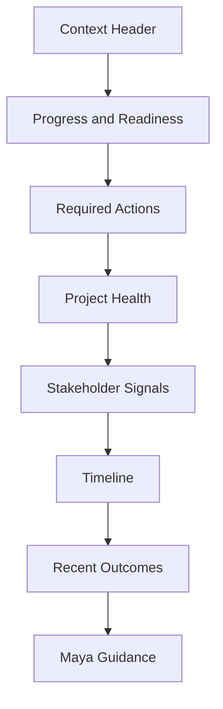

# Mission Control Architecture

**Document ID:** PS-UI-004  
**Version:** 1.0  
**Status:** Approved

## Purpose

Mission Control provides one operational view of the learner's current project situation.

## Primary Sections

- Current Chapter and Day
- Overall and Day Progress
- Required Actions
- Priority Alerts
- Project Health
- Stakeholder Signals
- Upcoming Meetings and Events
- Recent Consequences
- Completion Readiness
- Maya Guidance

## Layout

## Rules

1. Mission Control does not duplicate full Inbox or Meeting interfaces.
2. Required actions link to the correct operational surface.
3. Completed actions disappear from pending lists but remain in history.
4. Progress comes from Completion Readiness.
5. Alerts identify source and severity.
6. Project health metrics include explanations or trend context.
7. Maya guidance is advisory and visually separated.
8. Empty states explain why no action is required.
9. No redundant “Morning Inbox” and “Scenario Feed” sections should coexist when they serve the same purpose.
10. Every card must have a distinct user purpose.

## Revision History

| Version | Status | Description |
|---|---|---|
| 1.0 | Approved | Initial Mission Control architecture |
