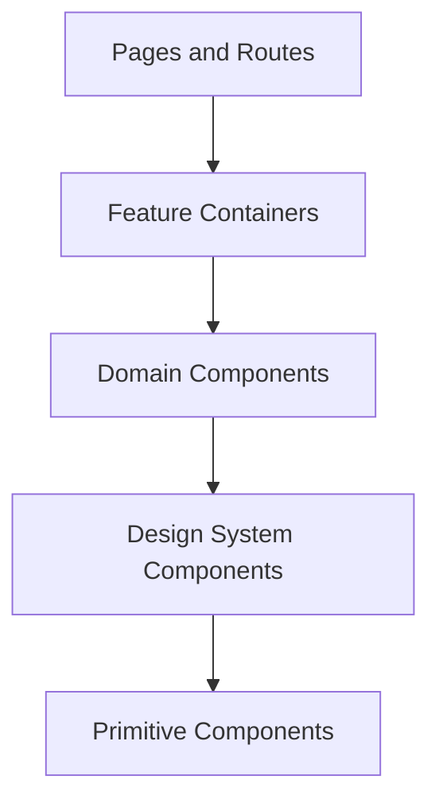

# Component Architecture

**Document ID:** PS-UI-007  
**Version:** 1.0  
**Status:** Approved

## Component Layers

## Categories

### Primitives
Button, Input, Select, Dialog, Tabs, Tooltip, Badge, Card.

### Design-System Components
StatusBadge, MetricCard, EmptyState, Timeline, DataTable, ActionPanel.

### Domain Components
DecisionCard, StakeholderSummary, RiskMatrix, CompletionPanel, MeetingAgenda.

### Feature Containers
MissionControlView, InboxView, MeetingCenterView, LearningView.

## Rules

1. Components receive typed props.
2. Domain components do not fetch data directly.
3. Feature containers use query and command hooks.
4. Primitives contain no ProjectSim business language.
5. Reusable components avoid route assumptions.
6. Loading, empty, error, and permission states are explicit.
7. Dialogs are not used as substitutes for navigation-heavy workflows.
8. Large features use composition rather than monolithic components.
9. Component APIs are documented.
10. Business rules remain outside components.

## Revision History

| Version | Status | Description |
|---|---|---|
| 1.0 | Approved | Initial component architecture |
