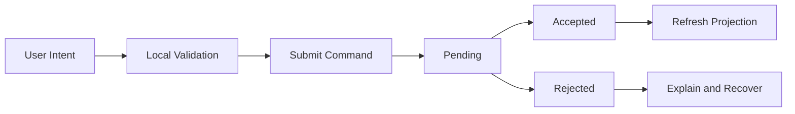

# Interaction and Feedback

**Document ID:** PS-UI-012  
**Version:** 1.0  
**Status:** Approved

## Interaction States

Every actionable component should define:

- Default
- Hover
- Focus
- Active
- Disabled
- Loading
- Success
- Error
- Permission denied

## Command Feedback

## Rules

1. Disable repeated submission while a command is pending.
2. Use idempotency for retries.
3. Accepted commands show confirmation.
4. Rejections explain the rule without exposing sensitive internals.
5. Consequences appear after the authoritative response.
6. Optimistic updates are limited and reversible.
7. Toasts do not contain critical information exclusively.
8. Long operations show progress or status.
9. Destructive and irreversible actions require confirmation.
10. AI-generated feedback is labeled and does not imitate system confirmation.

## Motion

Motion should explain hierarchy, transition, or causality. Decorative animation must remain restrained and respect reduced-motion preferences.

## Revision History

| Version | Status | Description |
|---|---|---|
| 1.0 | Approved | Initial interaction and feedback architecture |
