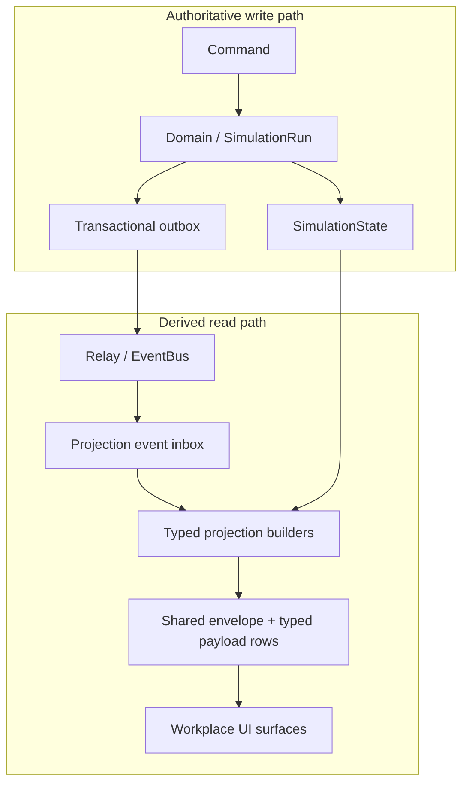

# Unified Workplace Projection Contracts

**Document ID:** PS-ARCH-016  
**Roadmap item:** PS-ROADMAP-009  
**Version:** 1.0  
**Status:** Accepted  
**ADR:** [ADR-006](../../adr/ADR-006-cqrs-style-projection-architecture.md)  
**Milestone:** Milestone 2 — Unified Workplace Experience (contracts gate)

---

## 1. Overview

PS-ROADMAP-009 defines the **projection contract system** that later Milestone 2
workplace slices will implement. It preserves one authoritative write model
while allowing all workplace views to converge from shared, derived,
learner-safe projections.

This milestone is architecture and contracts only. It does not ship workplace
product features, public workplace APIs, UI surfaces, or production migrations.

### 1.1 Rule provenance legend

Throughout this document, rules are tagged:

| Tag | Meaning |
| --- | --- |
| **Executable** | Enforced by current code / schema as of PS-ROADMAP-008 |
| **Blueprint** | Approved architecture docs; not fully implemented |
| **PS-009** | Decision accepted in this milestone / ADR-006 |
| **Deferred** | Explicit future work; not decided or not implementable yet |

---

## 2. Goals and non-goals

### 2.1 Goals

1. Define a reusable shared projection envelope for workplace read models. **(PS-009)**
2. Define a workplace projection taxonomy aligned to Milestone 2 capabilities. **(PS-009 + Blueprint)**
3. Specify typed learner-facing payload contracts per surface. **(PS-009)**
4. Preserve SimulationRun / SimulationState as the sole authoritative runtime store. **(Executable)**
5. Reuse rebuild, saveIfNewer, inbox, freshness, hashing, and RLS semantics. **(Executable + PS-009)**
6. Enable cross-surface convergence after one accepted learner action. **(Blueprint + PS-009)**
7. Keep hidden content out of learner-facing contracts. **(Executable)**
8. Give later slices enough precision to implement without reopening topology. **(PS-009)**

### 2.2 Non-goals

1. Implement Inbox, Meetings, Mission Control, Stakeholders, Documents, or Notifications. **(PS-009)**
2. Create new public workplace API routes. **(PS-009)**
3. Create new UI workplace surfaces or shell navigation. **(PS-009)**
4. Add a production database migration. **(PS-009)**
5. Change Decision lifecycle behavior. **(PS-009)**
6. Create a second authoritative runtime model. **(PS-009)**
7. Implement Stakeholder / Learning aggregates or Content Aggregate. **(Deferred)**
8. Silently rewrite blueprint docs that still describe aspirational tables/APIs. **(PS-009)**

---

## 3. Relationship to Milestone 1

Milestone 1 delivered the Decision vertical slice end-to-end:

| Capability | Status |
| --- | --- |
| SimulationRun / SimulationState authority | **Executable** |
| SubmitDecision command pipeline | **Executable** |
| Transactional outbox | **Executable** |
| Projection rebuild + event inbox | **Executable** |
| `projectionType: "simulation"` schema v1 | **Executable** |
| Public GET projection + POST submit-decision | **Executable** |
| Decision UI + Playwright E2E | **Executable** |

PS-ROADMAP-009 treats that canonical Simulation Projection as the **first**
workplace-related projection type and generalizes its envelope rules so
additional `projectionType` values can share the same consistency machinery.

---

## 4. Discovery record

### 4.1 Branch verification

| Check | Result |
| --- | --- |
| Branch | `cursor/ps-roadmap-009-workplace-projection-contracts` |
| Base commit | `72f0d26` (PS-ROADMAP-008 merge) |
| Working tree before edits | Clean |

### 4.2 Files and documents reviewed

**Roadmap / agent guidance**

- `docs/01-projectsim-2.0-implementation-roadmap.md`
- `docs/00-projectsim-2.0-master-index.md`
- `AGENTS.md`
- `docs/handbook/13_Documentation_and_ADR_Standards.md`
- `docs/handbook/17_Engineering_Risks_and_ADR_Backlog.md`

**Architecture blueprints**

- `docs/architecture/03-system-architecture/00_System_Architecture.md`
- `docs/architecture/03-system-architecture/01_Principles_and_Quality_Attributes.md`
- `docs/architecture/03-system-architecture/08_Projection_and_CQRS_Architecture.md`
- `docs/architecture/03-system-architecture/15_Architecture_Risks_and_ADR_Backlog.md`
- `docs/architecture/02-domain-model/00_Domain_Model.md`
- `docs/architecture/02-domain-model/02_Bounded_Contexts.md`
- `docs/architecture/02-domain-model/07_Projection_Aggregate.md`
- `docs/architecture/02-domain-model/13_Domain_Event_Catalog.md`
- `docs/architecture/04-database-architecture/01_Data_Ownership_and_Schema_Boundaries.md`
- `docs/architecture/04-database-architecture/07_Projection_and_Read_Model_Schema.md`
- `docs/architecture/04-database-architecture/10_Event_Store_Outbox_and_Audit.md`
- `docs/architecture/05-api-architecture/08_Projection_and_Query_API.md`
- `docs/architecture/05-api-architecture/03_Authentication_and_Authorization.md`
- `docs/architecture/07-ui-architecture/03_Projection_Driven_UI.md`
- `docs/architecture/07-ui-architecture/05_Workplace_Experience_Architecture.md`
- `docs/architecture/07-ui-architecture/02_Application_Shell_and_Navigation.md`
- `docs/architecture/07-ui-architecture/04_Mission_Control_Architecture.md`
- `docs/testing/e2e-decision-lifecycle.md`
- `docs/api/openapi/openapi.yaml`

**Executable implementation**

- `packages/domain/src/projection/contracts.ts`
- `packages/domain/src/projection/builder.ts`
- `packages/domain/src/projection/read-snapshot.ts`
- `packages/domain/src/projection/content.ts`
- `packages/domain/src/projection/payload.ts`
- `packages/domain/src/projection/hash.ts`
- `packages/domain/src/projection/source-position.ts`
- `packages/domain/src/projection/events.ts`
- `packages/domain/src/projection/projection.test.ts`
- `packages/application/src/simulation/projection/get-simulation-projection-service.ts`
- `packages/application/src/simulation/projection/rebuild-simulation-projection-service.ts`
- `packages/application/src/simulation/projection/projection-event-consumer.ts`
- `packages/application/src/simulation/projection/simulation-projection-repository.ts`
- `packages/application/src/simulation/command-application-service.ts`
- `packages/infrastructure/src/simulation/postgres/postgres-projection-repository.ts`
- `packages/infrastructure/src/simulation/postgres/postgres-composition-root.ts`
- `supabase/migrations/20260725040000_ps_roadmap_006_simulation_projection.sql`
- `apps/api/src/create-app.ts`
- `apps/web/src/features/decision/useSimulationProjection.ts`
- `apps/web/e2e/decision-lifecycle.*.spec.ts`

### 4.3 Documentation vs executable behavior

| Topic | Blueprint | Executable today | Handling in PS-009 |
| --- | --- | --- | --- |
| Projection types | Many named types (Inbox, Meetings, …) | Only `"simulation"` | Taxonomy defined; implementation **Deferred** |
| Storage | Separate `projection.*` tables sketched in PS-DB-007 | Single `simulation_projection` keyed by `projection_type` | Prefer existing table family (**PS-009**); blueprint tables remain aspirational |
| Query API | Per-surface GETs in PS-API-008 | Only `GET …/projection` | API direction documented; new routes **Deferred** |
| Envelope shape | Generic snapshot sketches | Flat `SimulationProjection` root fields | Conceptual envelope (**PS-009**); simulation type remains compatible |
| Workplace UI | Shell + channels in PS-UI-005 | Decision workspace only | **Deferred** |
| Outbox relay loop | Continuous consumer assumed | Relay exists; API does not auto-loop; GET sync-rebuilds | Note as operational **Deferred**; contracts unchanged |
| ADR folder | Backlog IDs listed | `docs/adr/` empty before this milestone | ADR-006 accepted (**PS-009**) |

Discrepancies are recorded, not silently “fixed.”

---

## 5. Primary architecture decision (topology)

### 5.1 Options evaluated

| Option | Summary | Verdict |
| --- | --- | --- |
| **A1** | Expand one SimulationProjection with all workplace sections | Rejected as long-term topology |
| **A2** | Fully independent projection types with independent consistency semantics | Rejected |
| **A3** | Shared envelope + typed payloads + common consistency rules | **Accepted (ADR-006)** |

### 5.2 Accepted direction (A3)



Rules:

1. One generic shared projection envelope. **(PS-009)**
2. Stable `projectionType` discriminator. **(Executable table + PS-009)**
3. Typed learner-facing payloads per workplace concern. **(PS-009)**
4. Persist using the existing projection table family. **(PS-009)**
5. Reuse saveIfNewer, inbox dedupe, freshness, and hashing. **(Executable + PS-009)**
6. Independent payload schema versions per type where justified. **(PS-009)**
7. SimulationRun / SimulationState remain authoritative. **(Executable)**

---

## 6. Unified workplace projection taxonomy

### 6.1 Projection types

| `projectionType` | Workplace surface | Initial status |
| --- | --- | --- |
| `simulation` | Decision workspace / run+project+decisions | **Executable** (schema v1) |
| `mission_control` | Mission Control summary | **Executable** schema v1 (**PS-011**; contract in **PS-009**) |
| `inbox` | Inbox | **Executable (PS-ROADMAP-014)** |
| `meetings` | Meetings | Contract only (**PS-009**) |
| `stakeholders` | Stakeholder interactions | Contract only (**PS-009**) |
| `decision_log` | Decision Log (history-oriented) | **Executable** schema v1 (**PS-012**; contract in **PS-009**) |
| `documents` | Documents | **Executable (PS-ROADMAP-020)** |
| `notifications` | Notifications | **Executable (PS-ROADMAP-021)** |
| `activities` | Active Activities | **Executable (PS-ROADMAP-022)** |
| `completed_history` | Completed Activities history | **Executable (PS-ROADMAP-022)** |

Naming note: taxonomy uses stable snake_case `projectionType` strings for
storage/API discriminators. Blueprint titles such as “Meeting Center” map to
`meetings`. **(PS-009)**

### 6.2 Relationship among types

- Types are **views**, not domains. **(Blueprint + Executable principle)**
- Multiple types may exist for one `(tenantId, simulationRunId)`. **(PS-009)**
- Completing one action must update every **affected** type through rebuilds
  from authoritative state/events — never through per-tab local truth. **(Blueprint + PS-009)**
- Mission Control is a summary view and must not become a second write model or
  a duplicate full Inbox/Meetings store. **(Blueprint + PS-009)**

---

## 7. Shared projection envelope contract

Conceptual TypeScript contract (specification only — not production code):

```ts
type WorkplaceProjectionType =
  | "simulation"
  | "mission_control"
  | "inbox"
  | "meetings"
  | "stakeholders"
  | "decision_log"
  | "documents"
  | "notifications"
  | "activities"
  | "completed_history";

interface WorkplaceProjectionEnvelope<
  TProjectionType extends WorkplaceProjectionType,
  TPayload,
> {
  projectionId: string;
  projectionType: TProjectionType;
  projectionSchemaVersion: number;

  tenantId: TenantId;
  simulationRunId: SimulationRunId;

  sourceAggregateVersion: number;
  sourceStateVersion: number;
  sourceActionSequence: number | null;
  sourceEventId: string | null;

  semanticHash: string;
  generatedAt: string;

  payload: TPayload;
}
```

### 7.1 Field rules

| Field | Rule | Provenance |
| --- | --- | --- |
| `projectionId` | Stable derived id; recommended form `projection:{type}:{tenantId}:{simulationRunId}` | **Executable** for simulation; **PS-009** for others |
| `projectionType` | Required discriminator; part of storage identity | **Executable + PS-009** |
| `projectionSchemaVersion` | Positive integer; versioned **per type** | **Executable + PS-009** |
| `tenantId` / `simulationRunId` | Required scope; never client-spoofed | **Executable** |
| Source cursors | See §9 | **Executable + PS-009** |
| `sourceEventId` | Provenance only; not a recency cursor; excluded from semantic hash | **Executable** |
| `semanticHash` | Deterministic fingerprint; not cryptographic integrity | **Executable** |
| `generatedAt` | Build timestamp; excluded from semantic hash | **Executable** |
| `payload` | Learner-safe typed body only | **PS-009** |

### 7.2 Compatibility with current SimulationProjection

The executable `SimulationProjection` is **envelope-compatible**:

- Envelope fields exist at the root today.
- Typed payload is the root blocks `run`, `project`, `availableDecisions`,
  `decisionHistory` (conceptually `payload` for `projectionType: "simulation"`).
- Future TypeScript refactors may introduce an explicit nested `payload` field;
  such a refactor is **Deferred** and must preserve Decision consumers.

Optional envelope extensions already present on simulation (`learnerId`,
`contentPackageVersionId`) remain allowed on typed payloads or type-specific
envelope supplements when required for that surface. **(Executable + PS-009)**

---

## 8. Typed per-surface payload contracts

Payloads are learner-facing contracts. They must not expose hidden Domain
internals. Field sets below are **contract skeletons** for later slices; empty
collections are valid (see §18).

### 8.1 `simulation` (existing)

**Executable** schema version **1**:

- `run` — lifecycle status/timestamps/chapter/day/content package
- `project` — status + metrics
- `availableDecisions` — eligibility-safe options only
- `decisionHistory` — learner-safe history items

Hidden by construction: consequence payloads, application keys, signals,
schedules, resolver versions, hidden reason codes. **(Executable)**

### 8.2 `mission_control`

Schema version starts at **1** when implemented. **(PS-009)**

Suggested payload:

- run summary (status, chapter/day)
- project status + key metrics
- counts: pending decisions, unread action-required inbox items, upcoming meetings
- next recommended actions (ids + labels only)
- freshness-sensitive summary only — no duplicated full channel bodies

Counts must come from the same authoritative eligibility/state used by channel
projections; UI must not recompute them. **(Blueprint + PS-009)**

### 8.3 `inbox`

- informational messages
- action-required messages
- linked decision status when applicable
- archived flag / archived query support
- never treat informational messages as pending decisions

### 8.4 `meetings`

- preparation / attendance / follow-up states
- agenda item links to decisions or activities
- unresolved commitments
- completed meeting records retained

### 8.5 `stakeholders`

- conversation summaries and histories that are learner-visible
- relationship summaries without hidden simulation variables
- distinction among messages, negotiations, escalations, follow-ups

### 8.6 `decision_log`

- one record per authoritative Decision
- pending/resolved (and future rejected/superseded when Domain supports them)
- rationale/choice/public result summary as learner-visible
- links to originating workplace items when those items exist
- must not diverge from `simulation.decisionHistory` for the same Decision

### 8.7 `documents`

- document identity, title, status, updatedAt
- links to related activities/decisions when available
- no authoritative document binary storage rules here (**Deferred**)

### 8.8 `notifications`

- notification identity, category, createdAt, read/unread
- deep link targets to other surfaces by id
- must not invent business completion state

### 8.9 `activities`

- accepted learner-action history suitable for workplace timeline
- command/action type labels, timestamps, sequences
- excludes internal processing receipts

### 8.10 `completed_history`

- completed workplace items retained after leave-channel flows
- includes completed decisions/meetings/messages as applicable
- refresh/reopen must preserve membership (**Blueprint DoD + PS-009**)

### 8.11 Source availability constraint

Many non-decision fields cannot be honestly populated until future aggregates
or content exist (Stakeholder, Learning, Inbox/Meeting runtime records). Until
then:

- contracts remain defined
- builders may return explicit empty collections
- builders must not fabricate Domain truth
- builders must not read UI state

**(PS-009 + Deferred)**

---

## 9. Projection identity and storage rules

1. Storage identity for a run-scoped workplace projection row:
   `(tenant_id, simulation_run_id, projection_type)`. **(Executable + PS-009)**
2. Prefer the existing `simulation_projection` / `projection_event_inbox` table
   family for new types. **(PS-009)**
3. Blueprint `projection.*` physical tables in PS-DB-007 remain aspirational
   alternatives; adopting them later requires a new ADR/migration and is
   **Deferred**.
4. Projection rows are never command mutation targets. **(Executable + Blueprint)**
5. Deleting projection rows must not affect SimulationRun / SimulationState. **(Executable)**
6. Commands and Domain code must never read projection rows. **(Executable)**

No production migration is introduced by PS-ROADMAP-009. **(PS-009)**

---

## 10. Source cursor semantics

Recency tuple (newer wins), matching executable comparison:

1. `sourceAggregateVersion`
2. `sourceStateVersion`
3. `sourceActionSequence`

Rules:

- Values are non-negative integers when present. **(Executable)**
- `sourceActionSequence` may be `null` in the generic envelope only when a
  future type has no action-sequence source; the current `simulation` type
  requires a non-null integer. **(PS-009 compatibility note)**
- `sourceEventId` is provenance for the trigger that wrote/replaced the row; it
  is not part of recency comparison. **(Executable)**
- Broker delivery time and `generatedAt` are not authoritative for freshness. **(Executable)**

---

## 11. Freshness semantics

Application/UI freshness values remain:

| Value | Meaning |
| --- | --- |
| `current` | Returned projection matches or was rebuilt to authoritative source position |
| `stale` | Reserved for explicitly lagging reads when a retained older projection is served |
| `rebuild_failed` | Rebuild failed; retained prior learner-safe projection may be returned read-only |

Rules:

1. Decision submission requires `freshness: current` for the simulation
   projection used by that UI. **(Executable)**
2. Stale / rebuild_failed workplace views are read-only with respect to mutating
   commands that depend on that view’s cursor. **(Executable principle + PS-009)**
3. Clients poll/refetch until `sourceAggregateVersion` reaches the command
   receipt aggregate version for affected projections. **(Executable + Blueprint)**

---

## 12. Semantic hash rules

1. Algorithm family remains a deterministic fingerprint such as
   `fnv1a64:v1:<hex>` unless a later ADR changes it. **(Executable)**
2. Hash covers learner-visible semantic payload + identity/source cursor fields
   required for equality checks. **(Executable)**
3. Hash **excludes** `generatedAt` and `sourceEventId`. **(Executable)**
4. Hash is not cryptographic integrity, authentication, or tamper protection. **(Executable)**
5. Same source position with a different hash fails closed. **(Executable)**
6. Each `projectionType` hashes its own typed payload; hashes are not expected
   to match across types. **(PS-009)**

---

## 13. Rebuild and saveIfNewer rules

1. Rebuild loads authoritative SimulationRun / SimulationState (and
   projection-safe content ports). **(Executable)**
2. Rebuild never mutates SimulationRun, reapplies Consequences, or resolves
   Decisions. **(Executable)**
3. `saveIfNewer`:
   - older source position → ignore
   - equal source + equal hash → idempotent no-op (no `ProjectionRebuilt`)
   - equal source + different hash → fail closed
   - newer source → replace
   **(Executable)**
4. Projection rebuild/subscriber failure must not block authoritative outbox
   publication or roll back committed Domain effects. **(Executable)**
5. Synchronous get-query rebuild remains an allowed recovery path when a row is
   missing or behind. **(Executable)**
6. Future multi-type rebuilds may rebuild one type or a declared fan-out set;
   fan-out must be explicit per trigger mapping (§15). **(PS-009)**

---

## 14. Event inbox and deduplication rules

1. Projection consumers deduplicate by **event ID**, not `sequenceNumber`. **(Executable)**
2. Multiple Domain events may share one action sequence. **(Executable)**
3. Successful rebuild marks the event processed; failed rebuild does not. **(Executable)**
4. Inbox is tenant-scoped (`projection_event_inbox`). **(Executable)**
5. When multiple projection types subscribe, processing records must not allow
   one type’s success to hide another type’s failure. Preferred approaches
   (**PS-009**, implementation choice **Deferred**):
   - per-`(tenantId, eventId, projectionType)` inbox keys, or
   - atomic fan-out rebuild of the declared type set for that event
6. Consumers must never throw in a way that stalls authoritative relay
   delivery. **(Executable)**

---

## 15. Cross-surface convergence rules

1. Completing one learner action updates every related workplace view through
   shared derived projections — not through tab-local stores. **(Blueprint + PS-009)**
2. Duplicate activities/decisions must not appear across surfaces that project
   the same authoritative Decision/action identity. **(Blueprint DoD + PS-009)**
3. Refreshing and reopening a run must preserve the same projected membership
   for completed/history items. **(Blueprint DoD + PS-009)**
4. Mission Control counts and channel lists that represent the same underlying
   work item must agree on identity and completion status after convergence. **(PS-009)**
5. UI components must not calculate eligibility, Consequences, metrics, mastery,
   or synthetic history. **(Executable + Blueprint)**
6. Browser storage must not become authoritative. Session-only E2E auth hooks
   remain non-authoritative test seams. **(Executable)**

---

## 16. Command → event → projection mapping

### 16.1 Current executable mapping (`simulation`)

| Trigger events (non-exhaustive) | Rebuild target |
| --- | --- |
| Lifecycle events (`SimulationRunCreated` … `Archived`) | `simulation` |
| `DecisionSubmitted`, `DecisionResolved` | `simulation` |
| `ProjectMetricChanged`, `ProjectStateTransitioned` | `simulation` |

**(Executable)**

### 16.2 Initial workplace fan-out intent

| Authoritative change class | Projection types to rebuild (when implemented) |
| --- | --- |
| Decision submit/resolve | `simulation`, `decision_log`, `mission_control`, `notifications`, `completed_history` (as applicable), `inbox`/`meetings`/`stakeholders` when linked |
| Project metric/state change | `simulation`, `mission_control` |
| Lifecycle status change | all implemented run-scoped workplace types for that run |
| Future inbox/meeting/stakeholder commands | corresponding channel type + `mission_control` + `notifications` + history types as applicable |

Exact event catalogs for unimplemented channels are **Deferred** with their
command slices. Mappings must be updated in the implementing slice. **(PS-009)**

### 16.3 Signals

Core Simulation may emit learning/stakeholder/analytics **signals** through the
outbox. Signals do not authorize Core to mutate Learning/Stakeholder aggregates
directly. Workplace projections that need those aggregates wait until those
write models exist. **(Executable boundary + Deferred)**

---

## 17. API direction

### 17.1 Current public API (**Executable**)

- `GET /api/v1/simulation-runs/{simulationRunId}/projection`
- `POST /api/v1/simulation-runs/{simulationRunId}/commands/submit-decision`

OpenAPI documents only these simulation routes.

### 17.2 Future workplace query APIs (**Deferred** product work)

PS-API-008 lists per-surface routes (`/mission-control`, `/inbox`, …).
PS-ROADMAP-009 **accepts the direction** that:

1. Projection endpoints remain read-only.
2. Responses carry shared meta: projection type, schema version, source
   aggregate version, generated/built time, freshness.
3. Clients do not reconstruct cross-tab counts.
4. Archived/completed items remain queryable where the contract says so.
5. New public workplace routes are added by later slices — **not** by this
   milestone.

Alternative acceptable shape (also **Deferred**): a parameterized read such as
`GET …/projections/{projectionType}` using the same envelope meta rules.
Choosing route style is an API-slice decision that must not reopen envelope or
authority rules.

### 17.3 Explicit non-delivery here

PS-ROADMAP-009 does not create new public workplace APIs. **(PS-009)**

---

## 18. Authorization and visibility rules

1. Tenant comes from verified JWT claims / server auth — never from a
   client-supplied tenant header as authority. **(Executable)**
2. RLS remains enabled/forced on projection tables with
   `tenant_id = app_current_tenant()`. **(Executable)**
3. Projection reads require appropriate view capability (today:
   `simulation.run.view` for simulation projection). **(Executable)**
4. Future workplace types may introduce finer capabilities; absence of a
   capability must not leak hidden fields. **(PS-009 + Deferred)**
5. Learner-facing payloads exclude hidden Domain content by construction. **(Executable + PS-009)**
6. Service-role credentials never ship to browsers. **(Executable)**
7. Admin/E2E seams remain non-production and must not weaken RLS for normal
   browser requests. **(Executable)**

---

## 19. Contract versioning and compatibility policy

1. `projectionSchemaVersion` is interpreted **per `projectionType`**. **(PS-009)**
2. Additive optional learner-visible fields may advance a type’s minor/compat
   policy only when readers ignore unknowns safely. Prefer explicit version
   bumps for workplace types. **(PS-009)**
3. Removing/renaming fields or changing meaning requires a schema version bump
   and a compatibility plan for that type. **(PS-009)**
4. `simulation` schema version **1** remains the Decision-slice contract until
   an intentional, tested migration of that type. **(Executable + PS-009)**
5. Envelope-level rule changes that affect all types require an ADR. **(PS-009)**
6. Projection schema versions are independent of
   `SimulationState.schemaVersion`. **(Executable)**

---

## 20. Empty and partial surface semantics

1. Unimplemented or not-yet-populated surfaces return a valid envelope with an
   explicit empty payload (empty collections / null optional summaries), not an
   invented busy workplace. **(PS-009)**
2. “Empty” means “no learner-visible items under current authoritative state,”
   not “error.” **(PS-009)**
3. Partial implementation of a type is allowed only if the shipped fields are
   honest and the schema version documents the supported subset. **(PS-009)**
4. UI may render empty states; UI must not fabricate substitute business truth. **(Blueprint + PS-009)**

---

## 21. Failure behavior

1. Projection build failure must not corrupt SimulationRun / SimulationState. **(Executable)**
2. Projection build failure must not roll back already committed Domain effects
   or stall outbox publication. **(Executable)**
3. Failed rebuilds are retryable via later triggers or synchronous get rebuild. **(Executable)**
4. When a previous learner-safe row exists, APIs may return it with
   `freshness: rebuild_failed` rather than exposing internals. **(Executable)**
5. Same-source hash mismatch fails closed. **(Executable)**
6. Authorization failures conceal cross-tenant data (no leakage via projection
   payloads or error details). **(Executable)**

---

## 22. Testing obligations for future slices

When a later slice implements a workplace `projectionType`, it must include:

1. Domain/unit tests for the typed builder (ordering, emptiness, hidden-field
   exclusion, deterministic hash).
2. Application tests for rebuild + saveIfNewer + inbox dedupe for that type.
3. Authorization/tenant isolation coverage.
4. Convergence tests: one authoritative action updates every declared affected
   type to the receipt aggregate version.
5. Compatibility tests when bumping that type’s schema version.
6. If a public route is added: OpenAPI + contract tests; no service-role exposure.
7. If UI is added: projection-driven rendering tests; no client-side business
   recalculation.
8. E2E only when the vertical slice claims user-visible completion; follow
   PS-ROADMAP-008 isolation and redaction rules.

PS-ROADMAP-009 itself adds documentation/ADR coverage, not new product tests. **(PS-009)**

---

## 23. Migration and rollout direction

| Phase | Work |
| --- | --- |
| Now (PS-009) | Contracts + ADR-006 + agent guidance; no migration |
| Next M2 slices | Implement builders/storage writes for one type at a time using existing table family |
| API/UI slices | Add routes/views per accepted contracts |
| Optional later | Revisit physical `projection.*` schemas only with a new ADR if the shared table family proves insufficient |

Rollout rule: never require a big-bang rewrite of `simulation` schema v1 to
start other types. **(PS-009)**

---

## 24. Deferred questions

1. Exact public route style: PS-API-008 per-surface paths vs parameterized
   `/projections/{projectionType}`.
2. Meeting/Stakeholder authoritative write models and command catalogs.
   System-delivered learner-message occurrences now exist on SimulationState
   (see PS-DOM-017); Inbox projection/API/UI remain PS-ROADMAP-014.
3. Whether Mission Control is purely derived from other projection builders or
   has its own builder over authoritative snapshots only (both must remain
   non-authoritative).
4. Per-type vs fan-out inbox key design for multi-type consumers.
5. Realtime push vs poll for workplace freshness.
6. Documents binary/object storage.
7. Alignment of Decision status machines (blueprint Validated/Rejected/Superseded
   vs executable submitted→resolved).
8. Continuous outbox relay worker process in API/runtime hosting.
9. Finer-grained workplace capabilities beyond `simulation.run.view` /
   `simulation.run.start`.
10. Whether blueprint separate `projection.*` tables are ever needed.

---

## 25. Accepted ADR

Accepted: [ADR-006 CQRS-Style Projection Architecture](../../adr/ADR-006-cqrs-style-projection-architecture.md)
(hybrid envelope + typed payloads).

---

## 26. Durable agent guidance

See `AGENTS.md` section **Unified workplace projections (PS-ROADMAP-009)** for
rules future cloud agents must follow when implementing M2 slices.

---

## Revision History

| Version | Status | Description |
| --- | --- | --- |
| 1.0 | Accepted | PS-ROADMAP-009 unified workplace projection contracts |
