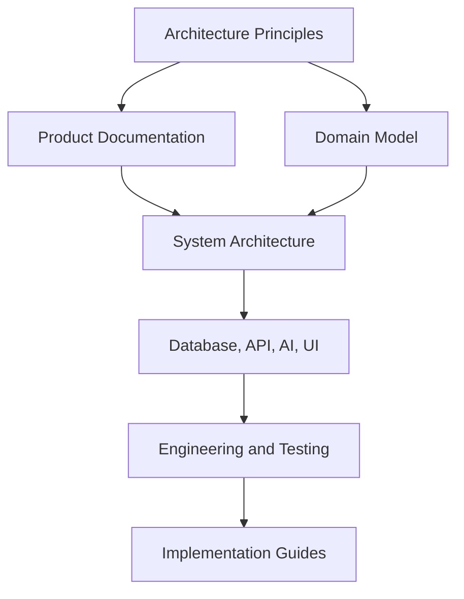

# Documentation Framework

**Document ID:** PS-HBK-000  
**Version:** 1.0  
**Status:** Approved  
**Owner:** Chief Software Architect

## Purpose

Define the structure, metadata, lifecycle, and governance of all ProjectSim 2.0 documentation.

## Documentation Hierarchy

## Standard Metadata

Every document should include Document ID, Version, Status, Owner, Purpose, Scope, References, and Revision History.

## Status Values

| Status | Meaning |
|---|---|
| Draft | Work in progress |
| Review | Awaiting review |
| Approved | Authoritative |
| Deprecated | Replaced but retained |
| Archived | Historical reference |

## Authority Rule

When documents conflict, the higher-level approved document takes precedence.
