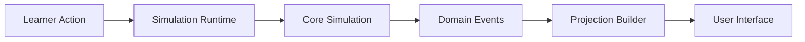

# Diagram Standards

**Document ID:** PS-HBK-002  
**Version:** 1.0  
**Status:** Approved

Use Mermaid whenever practical. Approved types include flowcharts, sequence diagrams, state machines, entity relationships, class diagrams, C4-style context/container diagrams, and journeys.

