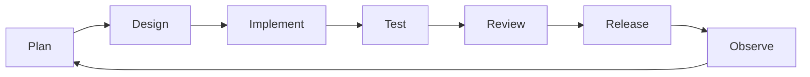

# Engineering Handbook Overview

**Document ID:** PS-ENG-000  
**Version:** 1.0  
**Status:** Approved  
**Owner:** Engineering Leadership

## Purpose

Define the engineering operating model for ProjectSim 2.0.

## Scope

This handbook governs:

- Repository structure
- Coding standards
- Testing
- Branching
- Pull requests
- CI/CD
- Security
- Observability
- Documentation
- AI-assisted development
- Release readiness

## Engineering Model

## Core Rule

No implementation is complete until code, tests, documentation, observability, and operational impact have been considered together.

## Revision History

| Version | Status | Description |
|---|---|---|
| 1.0 | Approved | Initial engineering handbook |
