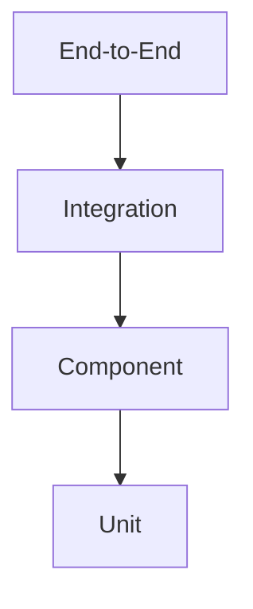

# Testing Standards

**Document ID:** PS-ENG-007  
**Version:** 1.0  
**Status:** Approved

## Test Pyramid



## Required Test Types

- Domain unit tests
- State-machine tests
- Invariant tests
- Repository integration tests
- RLS tests
- API contract tests
- Projection consistency tests
- Component tests
- Accessibility tests
- End-to-end tests
- Replay tests
- Idempotency tests

## Critical Simulation Tests

1. Valid command processing
2. Invalid command rejection
3. Duplicate command protection
4. Metric-delta correctness
5. Completion-rule correctness
6. Delayed-event creation
7. Replay determinism
8. Projection rebuild consistency
9. Stakeholder-history preservation
10. Mastery evidence creation

## Test Naming

```text
given_<context>_when_<action>_then_<outcome>
```

## Coverage

Coverage is a signal, not a target by itself. Critical domain paths require explicit behavioral coverage.

## Revision History

| Version | Status | Description |
|---|---|---|
| 1.0 | Approved | Initial testing standards |
