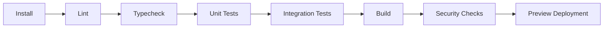

# CI/CD and Release Engineering

**Document ID:** PS-ENG-009  
**Version:** 1.0  
**Status:** Approved

## CI Pipeline

## Required Checks

- Dependency installation
- Formatting
- Linting
- Type checking
- Unit tests
- Integration tests
- Build
- Migration validation
- RLS tests
- Dependency audit
- Secret scanning
- Preview deployment

## Release Rules

1. Releases originate from protected branches.
2. Database migrations precede dependent code.
3. Feature flags protect incomplete features.
4. Rollback instructions exist.
5. Release notes summarize user and technical impact.
6. Production smoke tests run after deployment.
7. Observability is checked immediately after release.
8. High-risk releases use staged rollout where practical.

## Versioning

Use semantic versioning for packages and documented release identifiers for the platform.

## Revision History

| Version | Status | Description |
|---|---|---|
| 1.0 | Approved | Initial CI/CD and release standards |
